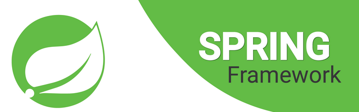

# G1DWJavaC3F3M4_BackEnd

## Módulo4: Java Backend Intermedio

## Equipo 6

### Integrantes

* Francisco Gómez

### Contenido

* [Sesión 1: Introducción a Spring 5 y Spring Boot 2]
* [Sesión 2: Servicios web RESTFul con Spring MVC]
* [Sesión 3: Spring MVC Validation]
* [Sesión 4: Manejo de errores y negociación de contenido]
* [Sesión 5: Project Lombok y MapStruct]
* [Sesión 6: Spring Data JPA]
* [Sesión 7: Pruebas unitarias e integrales]
* [Sesión 8: Spring MVC RestDoc]

Para este segundo módulo de
desarrollo Backend con Java; nivel
Intermedio se genero un miniCRM, con
Spring-boot y Gradle

[Referencia Oficial de Spring Boot](https://spring.io/projects/spring-boot)

## Enlaces

[Folder en GDrive]()

[Video presentación]()
